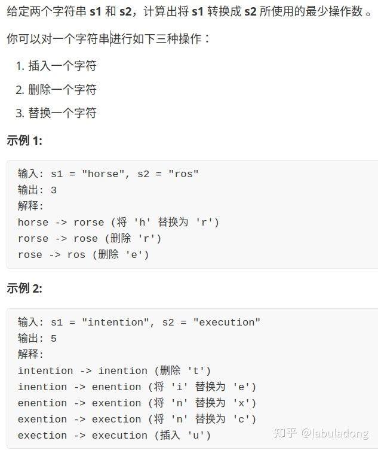
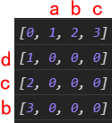
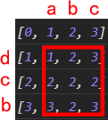

# 关于最小编辑距离的js实现

## 题目概要



## 算法实现

```js
const str1 = 'abc'
const str2 = 'dcb'
const len1 = str1.length
const len2 = str2.length

const plen1 = len1 + 1
const plen2 = len2 + 1
let stack = new Array((len1 + 1) * (len2 + 1))
stack.fill(0)
console.log('input str1:' + str1)
console.log('input str2:' + str2)

console.time('calc consume time')
/** init */
for (let i = 0; i < plen1; i++) {
  stack[(0 * len1) + i] = i
}

for (let i = 0; i < len2 + 1; i++) {
  stack[(i * len1) + i] = i
}

/** calc */
for (let i = 1; i < plen2; i++) {
  for (let j = 1; j < plen1; j++) {
    let _delete = stack[(i * plen1) + j - 1] + 1
    let _add = stack[((i - 1) * plen1) + j] + 1

    let _cost = str1[j - 1] === str2[i - 1] ? 0 : 1
    let _replace = stack[(i - 1) * plen1 + (j - 1)] + _cost
    stack[(i * plen1) + j] = Math.min(_delete, _add, _replace)
  }
}
console.timeEnd('calc consume time')
/** output */
let result = NaN
for (let i = 0; i < plen2; i++) {
  let temp = []
  for (let j = 0; j < plen1; j++) {
    let value = stack[(i * plen1) + j]
    temp.push(value)
    if (i === plen2 - 1 && j === plen1 - 1) {
      result = value
    }
  }
  console.log(temp)
}
console.log('The min edit distance is ' + result)
```

## 思路

记
str1.length = x
str2.length = y

我们首先初始化一个二维矩阵，宽为 x + 1 , 高为 y + 1



第一行和第一列为字符串的标号，其余内容以0填充

diff每一个字符串，计算全部可能发生的操作，例如 a -> d 的最优步骤次数，例如 a -> dc 的最优步骤次数，生成 x * y 矩阵

由于每一次计算，都是继承之前的最优结果为基础的，所以，矩阵节点 [x][y] 为最终的结果

记某矩阵节点为 [m][n]

删除操作，继承 节点 [m - 1][n] 的步骤 + 1
添加操作，继承 节点 [m][n - 1] 的步骤 + 1
替换操作，继承 节点 [m - 1][n - 1]， 判断 字符串 str1[m - 1] === str2[n - 1] 如果相等则 [m - 1][n - 1] + 1 如果不相等 则 等于 [m - 1][n - 1]

然后 取最小值

计算后得到矩阵(矩阵红框为计算内容)



例如红框内第一个节点 计算为 1 的计算步骤为
删除操作 [1][0] + 1 -> 1
添加操作 [0][1] + 1 -> 1
替换操作 对比 str1[0] 和 str2[0] 即 a !== d 所以 取 [0][0] + 1 === 1

最后取最小值为 1

以此类推，最终结果 为3（右下角的矩阵数）

## 最小编辑距离关于Vue diff 算法中的延伸

众所周知，如果我们有一对新老虚拟DOM树需要进行diff, 那么我们会采取对齐进行深度优先（dsf Depth First Search）的遍历
对比出两子树不同后，那么将进行 增、改、移动等操作，使两子树相同

如果老子树节点是 p、ul、div
新子树节点是 div、p、ul

那么老子树怎么替换成新子树呢？

上文提到的最小编辑距离的问题，就能够解答这个问题
[具体的算法实现](https://github.com/livoras/list-diff)

## 最小编辑距离历史

俄罗斯的数学家Vladimir Levenshtein在1965年提出，这个最小编辑距离的问题，所以算法书上一般把最小编辑成为 Levenshtein distance