# 浅谈微前端

微前端的概念：微前端是允许多个技术团队通过独立发布的方式来构建复杂且现代化Web应用App的一种技术

## 微前端的应用场景

当一个项目随着业务、团队人员、团队规模的变迁以及扩大，久而久之形成了一个会出现各种应用不可维护的情况，尤其是各类大型企业级的web应用

## 大型项目中存在的一些问题

大型企业级的web应用中，如果不使用微前端的相关架构设计，那么这类问题会越发突出：

1. 开发成本方面的问题
  - 项目启动变得非常慢
  - 代码结构臃肿
  - 模块应用混乱，存在跨模块引用等情况
  - 模块之间耦合愈加严重，如果某一个模块出现了致命bug，就会导致其他模块收到影响
  - 编译速度变得非常慢

2. 管理方面的问题
  - 不同项目技术栈要求不一样
  - 不同项目上线迭代的频率周期不一样
  - 不同项目代码风格，lint规则不一样
  - 项目庞大会导致新手接手愈发困难

所以为了解决这些问题，就孕育而出了微前端的架构设计，核心目的就是为了保证大型项目的高内聚，低耦合

## 微前端的优势

微前端架构的优势，可以保证

1. 不同项目的迭代节奏是可以完全独立开的，因为可以保证每一个子仓的代码分离，保证每一个独立的应用，独立开发、发布、测试、灰度

2. 运行时保证独立: 不同项目之间运行状态保持隔离

3. 不同项目可以使用不同的技术栈

4. 允许不同团队不同成员通知构建大型的web应用

## 微前端的原理和实现

### 通过iframe实现微前端

iframe 天然自带环境隔离机制，自带样式，设计之初就是为了做沙盒机制

但是iframe存在许多缺陷：

1. 对于登录来说跳转不友好，单开一个iframe会局部跳到登录页面登录然后在局部跳回来，而不是整个页面一体跳转
2. 上下文几乎完全隔离，通信很麻烦
3. 公共的JS/CSS这类资源没有办法复用
4. 视窗/弹窗会存在定位不准确的问题
5. 由于需要从0-1加载一个运行环境，导致加载速度偏慢
6. 路由不同步

## 微前端架构

微前端的架构主要分为三个部分

1. 核心主基架
2. 应用管理
3. 各个子应用

而一个企业级的框架起码还需要额外增加

1. 权限管理模块
2. 发布管理模块
3. 实验管理模块

### 核心主基架

主要功能：
1. 根据微前端子应用清单，加载和注册所有子应用
2. 管理所有子应用公用的vendor依赖

### 应用管理

有了核心主框架的支撑，在主框架的基础上，进行应用管理：
1. 子应用实现异步按需加载
2. 劫持路由，根据url 的变化，跳转到不同子应用
3. 子应用之间保持相互独立的同时，允许计划内的数据共享

应用管理的核心是Loader(加载器)，Loader将微前端主框架加载子应用的手段

### 子应用沙盒

每一个子应用被放入一个个运行的沙盒内，确保每一个子应用之间的副作用影响减少到最低：

这些副作用包括：
1. 样式的互相影响
2. 事件的互相影响
3. 全局变量的互相影响

这样就解决了上述的问题，允许不同的子应用交给不同团队，使用不同的技术栈，不同的css样式风格，不同的lint规则，不同的迭代周期，进行迭代

### 权限管理模块

允许不同子应用能和打通公司的权限模块打通，在核心主基架的注册阶段就能够根据权限注册当前用户能够访问的子应用

### 发布管理模块

一个允许不同子应用能够独立执行资源打包/构建/发布的平台,
允许不同子应用独立执行对应配置的流水线脚本(pipeline script)，对代码进行扫描
允许实现小流量/灰度发布

### 实验管理模块

允许同一个用户命中不同的实验层，实验层可以保证不同子应用之间的实验，变量是受控的，确保实验结果的正确性

## 微前端的生命周期

目前主流的一些微前端框架，主要通过监听url 的变化，当url中的路由发生变化后，根据注册的模块映射表来匹配到对应的子应用进行渲染



## 核心实现

想了解细节的可以阅读 [杨艺韬 写的沙箱剖析](https://www.yangyitao.com/microfe/)
这里只浅谈

### 加载器的实现

加载器主要的功能是实现一个独立的上下文环境，加载子应用，我们首先可以想的的是eval函数

子应用的代码经过打包后，异步加载，然后通过eval函数，在主框架内执行，
但是eval函数存在安全和性能的问题，也不利于调试

new Function 也能通过传入一个字符串来执行代码，和eval相比，new Function 具有两个不同：

1. 执行速度更快，new Function 在执行过一次代码之后，第二次执行会直接返回上一次执行的快照，但是eval却会重新执行

```js
var str = '';
for (let i = 0; i < 10000; i++) {
  str += `var test_${i} = ${i};\n`;
}

console.time('使用eval执行第一次')
eval(str);
console.timeEnd('使用eval执行第一次');

console.time('使用eval执行第二次')
eval(str);
console.timeEnd('使用eval执行第二次');

var fn = new Function(str);

console.time('使用new Function执行第一次');
fn();
console.timeEnd('使用new Function执行第一次');

console.time('使用new Function执行第二次');
fn();
console.timeEnd('使用new Function执行第二次');
VM332:8 使用eval执行第一次: 17.69580078125 ms
VM332:12 使用eval执行第二次: 11.406005859375 ms
VM332:18 使用new Function执行第一次: 0.031005859375 ms
VM332:22 使用new Function执行第二次: 0.02294921875 ms
```

可以发现，new Function 比eval快很多，同时第二次new Funcionn 比第一次new Function快

2. 作用域不一样，eval中的代码执行时的作用域为当前作用域。它可以访问到函数中的局部变量。而new Function中的代码执行时的作用域为全局作用域，不论它的在哪个地方调用的，它访问的都是全局变量。

```js
let foo = "foo";
function loader() {
  let foo = "bar";
  eval("console.log(foo)"); // 输出bar
  new Function("console.log(foo)")(); // 输出foo
}
loader();
```

这样就存在问题，eval可以访问到执行loader函数的上下文变量，这可能是比较危险的，但是new Function访问不到执行器的上下文变量，只能访问到全局变量，既避免了危险, 又能够保证数据通过全局变量分享

一个简单的加载器，思路就是异步加载子应用的js bundle代码，然后通过 commonJS 或者 esm 模块规范，动态加载子应用，并注入一些公共依赖

```js
this.subAppLoader = fetch(path.url)
  .then(commonjs(name, module)) // 将下载下来的代码，使用commonjs api规范化
  .catch(e => {
    this.subAppLoader = null;
    throw e;
  });

// 使用Function执行子应用经过commonjs规范化之后的代码，并注入一些模块化相关的变量
(new Function('require', 'exports', 'module', sourceCode)).call(
  module.exports,
  module.manager._require,
  module.exports,
  module
)

// 通过模块化变量，往子应用内注入外部变量
module.setRequire((name) => {
  return externals[name]
})
```

## 沙箱

沙箱的概念是微前端中比较具有挑战的事情，原本iframe是实现沙箱一个很好的方式，但是由于上面提到的种种缺点，所以只能通过代码来实现一个沙箱架构，从而完成多个团队之间在微前端内实现代码互不产生影响

从功能上，沙箱分为JS 和 DOM/样式沙箱，从实现方式上来看，沙箱分为 “快照沙箱” 和 “VM沙箱”

