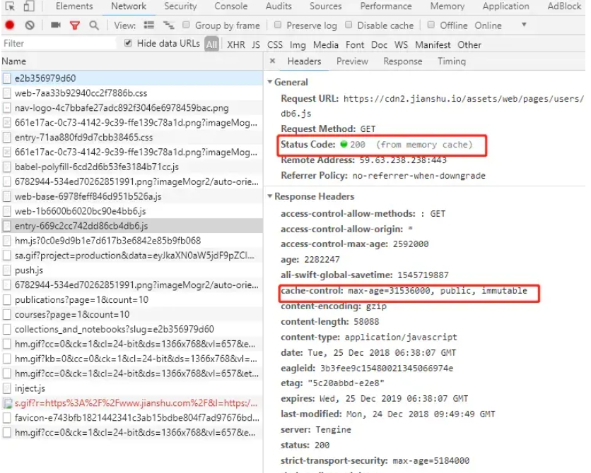

# 前端性能优化

注：全文“资源”如无特殊说明，均代指 图片、视频、音频、字体、js脚本等网页所必须的资源

## 缓存策略


首次请求一个资源后，服务器会返回这个资源3个关键的响应头到前端，浏览器会记录这个资源所相关的数据，分别是：
1. cache-control (强缓存策略，包括缓存时间/可缓存性/重验证和重加载策略)
2. etag 资源文件的hash
3. last-modified 资源文件上一次的修改时间

### 强缓存

当浏览器尝试访问一个资源的时候，如果服务器有设定强缓存，强缓存策略, 则直接从本地缓存中返回该资源



其中，
1. 如果是从本地缓存的资源则 status code 会为200且标注为 from memory cache
2. 服务器通过 cache-control 来控制强缓存，当资源超过max-age (秒)之内，都直接不发起请求，走本地缓存文件

具体可以看MDN上关于cache-control的介绍，不赘述

### 协商缓存

当强缓存失效后，需要发请求和和服务器进行协商，将之前存的Etag 和 Last-modified 分别以两个请求头IF-None-Match 和 If-modified-Since 的方式发回给服务器, 当然如果之前服务器就没有给Etag 和 Last-modified 的话，就无法进行协商了，直接真正发起请求

为什么最好要同时判断etag 和 last-modified 呢？

1. Etag要优于Last-Modified。Last-Modified的时间单位是秒，如果某个文件在1秒内改变了多次，那么他们的Last-Modified其实并没有体现出来修改，但是Etag每次都会改变确保了精度；
2. 在性能上，Etag要逊于Last-Modified，毕竟Last-Modified只需要记录时间，而Etag需要服务器通过算法来计算出一个hash值；

服务器可自定义策略，根据Etag 和 Last-modified 来判断，一般策略是：
如果有Etag，则优先判断Etag是否和服务器现存的文件的hash一致，如果不一致，直接需要重新请求资源，如果一致，则没有必要继续请求了，返回304，并刷新资源的cache-control，客户端则继续使用本地缓存文件

如果没有etag, 则需要校验Last-modified, 如果资源文件的修改时间和上一次修改的时间不一致则需要重新请求资源，反之则返回304，并刷新，并刷新资源的cache-control，客户端则继续使用本地缓存文件

## 延迟加载和预加载

延迟加载和预加载是浏览器为了提高网页的加载速度和用户体验，而采用的两种优化策略。
延迟加载是指将一些不重要或者不可见的资源推迟到用户需要时再加载，而不是一开始就加载。这样可以节省网络带宽和内存空间，提高网页的首屏渲染速度，避免浪费用户的流量和电量。
预加载是指将一些可能会被用户需要的资源（如链接、脚本、样式等）提前加载到浏览器缓存中，而不是等到用户点击时再加载。这样可以减少网络延迟和白屏时间，提高网页的响应速度，提升用户的满意度。
浏览器如何根据用户的行为和网页的结构，智能地决定何时加载和渲染哪些资源呢？主要有以下几种方式：
- 利用 Intersection Observer API 来检测元素是否进入或者离开视口，从而动态地控制元素的加载和卸载。
- 利用 requestIdleCallback API 来在浏览器空闲时执行一些低优先级的任务，如图片解码、垃圾回收等。
- 利用 rel=“preload” 和 rel=“prefetch” 属性来指定哪些资源需要被预加载或者预获取，以及它们的优先级和类型。
- 利用 Resource Hints API 来给浏览器一些关于资源位置、大小、重要性等方面的提示，从而帮助浏览器做出更好的决策。
- 利用 Service Workers API 来在后台缓存一些静态资源或者动态生成一些响应，从而实现离线访问或者快速更新。

## Resource Hints

资源提示（Resource Hints）是一种通过 HTML 的 <link> 元素，使用 rel 属性值为 dns-prefetch， preconnect， prefetch， prerender 或 preload 的技术，用来指示浏览器应该提前连接或获取哪些源或资源。这些提示可以帮助浏览器优先处理重要的资源，从而提高页面性能。
Chrome 支持以下五种资源提示：

### dns-prefetch

DNS 预解析是一种在用户尝试访问一个链接之前，提前对链接中的域名进行解析的技术。这样做可以利用计算机的正常 DNS 解析机制，无需连接到服务器。一旦一个域名被解析，如果用户确实导航到该域名，就不会因为 DNS 解析时间而产生有效的延迟。

Chrome浏览器 支持两种方式来进行 DNS 预解析：一种是通过 HTML 的 元素，使用 rel 属性值为 dns-prefetch，并在 href 属性中指定跨源域名，如下所示：

```html
<link rel="dns-prefetch" href="https://fonts.googleapis.com/" />
```

另一种是通过 HTTP 响应头，使用 Link 字段来指定 DNS 预解析的提示，如下所示：

```
Link: https://fonts.googleapis.com/; rel=dns-prefetch
```

Chrome浏览器也会根据网页中的标签和用户的浏览历史，自动进行 DNS 预解析。
Chrome 也会根据用户的网络环境和操作系统的设置，智能地选择是否启用或禁用 DNS 预解析。
根据一项性能测试，DNS 预解析可以将网页加载时间减少约 250 毫秒。这主要是因为 DNS 预解析可以避免在请求跨源资源时发生 DNS 查找延迟。

### preconnect

建立HTTP/HTTPS连接的前提是进行DNS解析和TCP握手，如果有HTTPS的话还需要进行TLS的连接

目前页面上的资源多数会用到HTTPS协议，总所周知，其中的s就是指的TLS（Transport Layer Security，传输层安全）, 而TLS中使用到的加密协议就是SSL 3.0（Secure Sockets Layer，安全套接字层）

这里不展开说明安全层如何建立连接，密钥交换的，已知这个过程肯定是有耗时的，如果我们可以在用户访问HTTPS的资源前就建立好DNS解析、TCP握手和TLS连接，就可以减少耗时，优化性能, 同时后续用户如果访问了同一个HTTPS域名的其他资源，也不会因为 DNS 解析时间、TCP 握手时间和 SSL 连接时间而产生延迟。

如果是同源资源，那么在用户一开始访问网页的时候，就已经完成了TLS的连接和密钥交换了，所以preconnect主要优化的是，打开页面后，针对页面后续所可能需要访问的跨源域名非同源的资源。提前对这个资源的域名提前做DNS 解析、TCP 握手和 SSL 连接，

Chrome 支持两种方式来进行 SSL 预连接：一种是通过 HTML 的 元素，使用 rel 属性值为 preconnect，并在 href 属性中指定跨源域名，如下所示：

```html
<link rel="preconnect" href="https://fonts.googleapis.com/" crossorigin />
```

另一种是通过 HTTP 响应头，使用响应头 Link 字段来指定 SSL 预连接的提示，如下所示：
```
Link: https://fonts.googleapis.com/; rel=preconnect
```

同时Chrome浏览器也会主动地根据网页中的标签和用户的浏览历史，自动进行 SSL 预连接。Chrome 也会根据用户的网络环境和操作系统的设置，智能地选择是否启用或禁用 SSL 预连接。
根据一项性能测试，SSL 预连接可以将网页加载时间减少约 200 毫秒。这主要是因为 SSL 预连接可以避免在请求跨源资源时发生 DNS 查找延迟、TCP 握手延迟和 SSL 连接延迟。

### prefetch

用于提前获取当前页面可能需要的资源，如图片、样式表、脚本等。这些资源会被缓存在浏览器中，直到当前页面或后续页面需要使用它们。

### prerender

用于提前渲染当前页面可能导航到的下一个页面，包括获取和执行其所需的所有资源。这些页面会被缓存在浏览器中，直到用户点击相应的链接。

### preload

用于提前获取当前页面必需的资源，如字体、视频、音频等。这些资源会被优先加载，并且不受浏览器默认的加载策略影响。
Chrome 会根据网页中的 <link> 标签和用户的浏览历史，自动进行一些资源提示。Chrome 也会根据用户的网络环境和操作系统的设置，智能地选择是否启用或禁用某些资源提示。
根据一项性能测试，使用资源提示可以将网页加载时间减少约 10% 到 20%。这主要是因为资源提示可以避免在请求重要资源时发生 DNS 查找延迟、TCP 握手延迟、SSL 握手延迟和网络拥塞等问题。

## 离线缓存

离线缓存是一种在用户访问一个网页或应用时，将其所需的资源（如图片、样式表、js script等）缓存在本地的技术。这样做可以使用户在没有网络连接或网络连接不稳定的情况下，仍然能够浏览或使用这些网页或应用。

根据一项性能测试，使用离线缓存可以将网页加载时间减少约 50% 到 80%。这主要是因为离线缓存可以避免在请求重要资源时发生网络延迟和失败等问题。

Chrome 支持以下几种方式来实现离线缓存：

- Offline Files：这是一种 Windows 系统的功能，它可以将网络上的文件夹或文件同步到本地，并在网络不可用时提供访问。 Chrome 可以利用这个功能来缓存一些网页或资源，但它需要用户手动启用和配置。

- LocalStorge: Web 平台的功能，可以允许开发者存储一些简单的key:value数据字段永久缓存到本地

- Service Workers 和 Cache API：这是一种 Web 平台的功能，它可以让开发者在浏览器后台运行一些脚本，从而实现对网络请求的拦截和处理。Chrome 可以利用这个功能来缓存一些网页或资源，并在网络不可用时从缓存中返回，操控缓存的API为Cache API， 所以Cache Api 即Service Workers标准的一部分。但是它不必一定要配合 service worker 使用。它可以让开发者通过编程的方式创建和管理多个命名的缓存对象，并在其中存储请求和响应对象。Chrome 可以利用这个功能来缓存一些网页或资源，并在网络不可用时从缓存中返回。

- IndexedDB：这是一种 Web 平台的功能，它可以让开发者通过编程的方式创建和管理一个结构化的数据仓库，并在其中存储各种类型的数据。 Chrome 可以利用这个功能来缓存一些网页或资源，并在网络不可用时从数据仓库中读取。