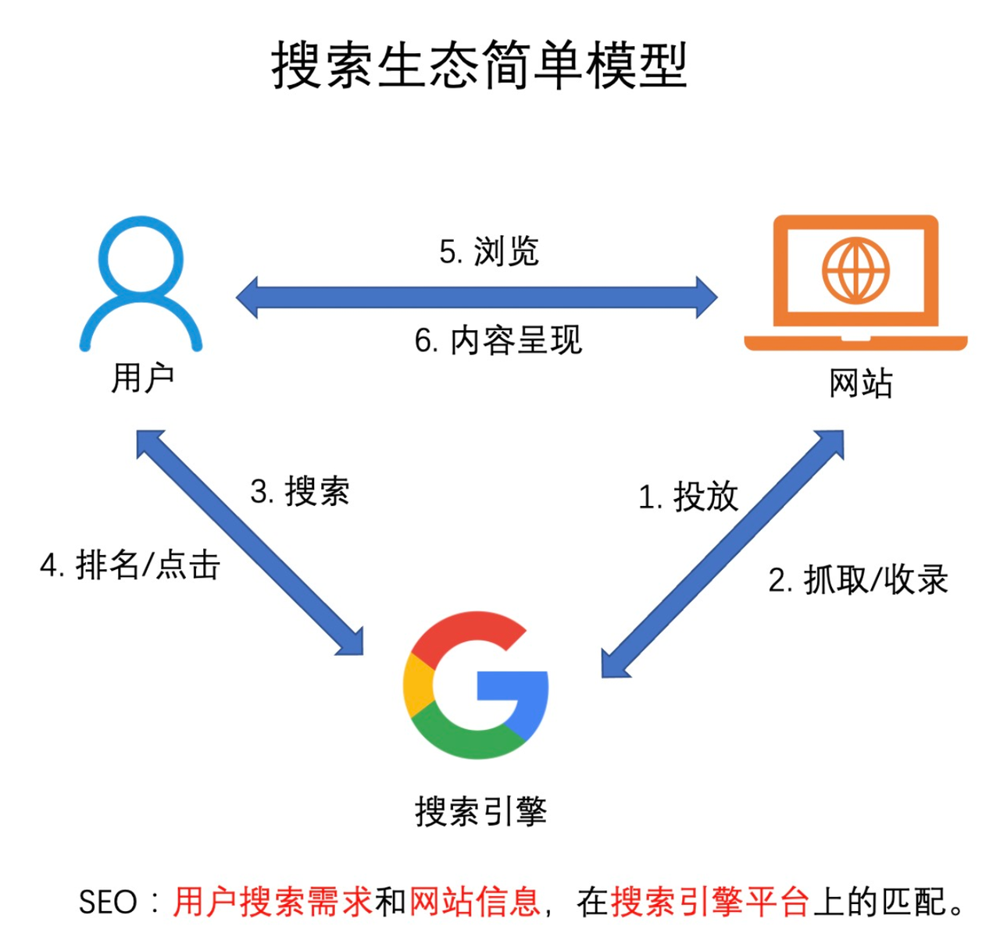
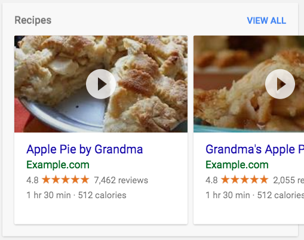

# SEO 基础

SEO(Search Engine Optimization)搜索引擎优化，即通过一系列产品、运营、技术优化手段，帮助搜索引擎更好地发现并理解网站内容，从而提高网站在搜索引擎的自然排名，获取更多曝光与流量，增强用户的品牌认知。



## SEO的收益

- 拉新收益
  - 拓宽渠道，带来自然流量增长，高质量的新增用户
- 品牌收益
  - 内容相关性，建立并增强用户对产品的印象、认知和认同
- 辅助内容验证
  - 通过站点指标，辅助站内生态内容决策

## SEO的原理

- 爬取网页
   - 发现、访问网页及其页面中的子级页面
      1. 主动发现
         - 生成合理的sitemap文件，并配置权重，等待爬虫根据sitemap爬取页面
         - 通过主动调用搜索引擎公开的Indexing Api，更快主动通知搜索引擎，但是每天有配额
         - 拓词，增加可以搜到我们网站的关键词数量，从而广度上拓宽搜索流量
      2. 被动发现
         - 内链，网页内多级页面之间铺设好链接，增强站内流量的连通性
         - 外链，站外其他网页增加链接，引流到我们站内
      3. 阻止发现
         - 主动提示爬虫机器人，站内无用的网页不爬取，节省爬虫资源
      4. 重复页面处理
         - 网站中会出现内容相同或者高度相同的页面，但是url不一致，我们需要“告诉”爬虫这些页面从业务角度来说是同一个
- 建立索引
   - 理解网页、建立索引，搜录网页（索引）
      1. 网页结构优化，方便爬虫理解网页
         - SSR的网页针对SEO进行优化
         - 语义化标签
      2. 阻止索引
         - 站内某些页面，是不希望搜索引擎爬取到的，需要阻止给爬虫结果
- 展示搜索结果
   - 用户根据关键词进行搜索的时候，根据关键词结合权重、竞价排名，展示搜索结果
      1. 搜索结果页面的优化
         - 针对搜索结果页面的内容可以更吸引用户的眼球，激发访问兴趣，提高流量点击率，同时可以承载搜索关键词，提升排名竞争力
         - 网页的**TDK(Title/Description/Keywords)**
         - URL优化，让网页的url便于爬虫的理解
         - 结构化数据
      2. 加载性能
         - 网页的加载性能也可能影响到搜索引擎对于网站检索权重，衡量标准一般是谷歌的[Core Web Vitals](https://web.dev/vitals/#core-web-vitals)。
      3. 内容质量
         - 提升站内良好的内容质量和用户体验才是提升排名的根本，技术角度上要做到避免关键词的堆叠，或者通过某些其他作弊手段，企图欺骗搜索引擎提升排名

## 主动爬取网页

### sitemap

sitemap 是一个文件，里面列出当前网站里有哪些网页、图片、视频等资源，有利于搜索引擎更好地发现并了解网站里的网页资源。
sitemap 对于用户原创内容(UGC User Generated Content)的网站来说是非常有用的，如B站、知乎、小红书等，这些网站中很多网页的内容都是用户原创的，如果一个网页，没有被其他的网页链接到，又缺乏其他的曝光手段，是很难被搜素引擎发现的，那么主站就必须承担监控UGC热度，并曝光给搜索引擎的责任，如何主动曝光给浏览器
让爬虫爬取到这些承载了用户原创优质内容的网页呢？我们可以建立站内热榜，将站内热榜中的网页的url写进主站的sitemap中
这样搜索引擎爬虫每个周期定时爬取网页的时候，这些用户原创内容的网页就会被搜索引擎发现并爬取

值得注意的是，由于爬虫资源是有限的，所以sitemap的大小也是有限制的，需要被尽可能压缩，同时只放入哪些高价值的UGC内容
同时也需要根据每天的站内热榜，定时更新主站的sitemap，将过了热度的网页url替换掉

#### 如何维护 sitemap ?

1. 链接搜集

- 首先主站内的一些固定页面，自动通过脚本爬取，比如通过 [sitemap-generator](https://www.npmjs.com/package/sitemap-generator) 自动爬取网站内的各个固定页面，获取这些页面的链接，由于业务迭代，固定页面是会随业务增减的，所以需要脚本自动爬取、人工进一步核验
- 根据我们实际业务中维护的站内热榜，搜集站内内容价值高的UGC资源，如热点、精品、官媒权威、拓词等等
- 检查并过滤掉失效、重复、敏感非法的网页

2. sitemap 生成

如果单一 Sitemap超过50 MB，就必须将这个大型Sitemap分割成多个Sitemap。所以我们就需要建立 sitemap 索引来管理我们的sitemap
一个成熟的公司会建设自己的sitemap自动化生成的工具，专门用来生成sitemap 和 sitemap 索引，增删改查索引，并自动上传cdn并提交到搜索引擎的能力

我们将第一步搜集到的链接，写入到多个sitemap中，而后和sitemap 索引一并上传cdn后提交到搜索引擎，等待爬虫对我们的网站进行爬取

3. 工程化

基于上面的流程进行基本的流水线化，包括

- 自动化生产、上传、发布
- 定时触发
- 多个业务间复用
- 全流程日志、监控等


### Indexing API

Indexing API 可以用来帮助搜索引擎网页更快地发现并收录网页，因为sitemaps上传搜索引擎后，还需要等待爬虫来被动爬取，
但是Indexing API可以允许我们主动快读地通过接口请求的方式，把我们上述搜集到的热点网页的url主动告知搜索引擎
但是Indexing API对于每一个站点是有额度限制的，不能一直主动更新
具体的Indexing API文档可以自行检索查询

### 拓词

拓词指的是增加可以搜到我们网站的关键词数量。一般的做法是根据新的关键词或者热点词自动生成内容页（拓词页），然后将拓词页的url。主动报给搜索引擎

#### 如何管理关键词？

1. 主站内的检索关键词
   - 站内长尾词(长尾词是指由2-3个词组成的关键词，甚至是短语，比如通过 "三亚旅游" 一个基本关键词可以衍生出 “北京到三亚机票” “北京到三亚打折机票” “三亚旅行社” “三亚就餐推荐” 这些衍生出的词就是长尾词，长尾词针对性强，范围广，能够带来更多的搜索流量)

2. 站内外或者社交媒体的热点、热搜
   - 百度、微博热搜
   - Google Trends
   - Google Search Console

3. 运营同学主动干预配置关键词
   - 审核
   - 去重，去重意义相同但字符串不同的词
   - 画风品控
   - 人工下线


## 被动推广网页

1. 站内外，多个业务多个页面之间内链互通
2. 在其他网站上通过运营手段推广主站
   - 公关稿
   - 友情链接互动
   - 广告，软文，恰饭视频
   - 社交媒体中水友激情互动
   - 抽奖宣传等等

## 阻止发现网页

配置好robots.txt文件，用于提示各搜索引擎哪些页面不允许爬取，哪些允许，以及用于列出 sitemap 的地址。
对于例如404页面，站内鉴权中转页等功能性页面，不需要被爬虫爬取，干扰SEO效果的网页，就要被列入在robots中，让爬虫别爬

## 网页结构优化

前端目前SPA站点，前端路由这些技术非常成熟，也应用的很广泛，但是这会影响到搜索引擎爬虫的执行，因为SPA技术的站点html内一开始是没有任何和业务相关的dom节点的
而对于搜索引擎爬虫来说，能直接爬取到页面内容的 HTML 是最高效的，否则还得等js执行完后才能爬取到有效的内容，此外在搜索引擎环境中执行js也不太靠谱，可能会js遇到网络异常，js无法正常执行等等情况，从而影响到SEO的结果

所以我们需要通过SSR来进行SEO优化，
SSR的SEO优化，对于不同业务方案千差万别，但大体都会涉及这几个方面：
- SSR 入口文件
- 服务端环境兼容
- 业务数据拉取
- 缓存控制
- CSR 降级

具体方案，网上有很多，不赘述

## 语义化标签

HTML5的语义化标签，包括H 标题、链接、图片、强调、文章、段落，语义化标签可以快捷的告知爬虫，页面的结构，页面内哪些是关键词等等，这块知识网上也很多，不赘述

## 阻止索引

有一些页面不需要支持搜索以及展示在搜索结果，也可以在页面中放个meta标签,或者当请求是爬虫的时候，给404或410的错误码
```HTML
<meta name="robots" content="noindex">
```
来阻止搜索引擎收录这些页面。

## 搜索结果页面的优化

### 确定网页的TDK(Title/Description/Keywords)

确定网页的TDK，可以给到搜索引擎更多对于网页的描述，这些信息能够展现在最终的搜索结果的页面中

| 优化项 | 代码 | 作用
|---------- |-------- |-------- |
| Title | `<title>标题</title>` | 包含品牌词、内容关键词 |
| Description | `<meta name="description" content="....">` | 包含关键词、作者信息、吸引用户的话术、体现价值的数据（点赞数） |
| Keywords | `<meta name="keywords" content="....">` | 1. 包含品牌词、内容关键词及相关拓词 2. meta keywords 对排名影响不大，不用花精力优化 |

### 语义化 URL

语义化的 URL 也可以承载一些关键词，有利于搜索引擎判断网页与搜索词的关联度

例如：

|  | 话题标签 | 用户主页 |
|---------- |-------- |-------- |
| bad url | /tag/668975222153 | /user/568973222153 |
| good url | /tag/NBA | /user/@username |

### 结构化数据

结构化数据是一种 JSON-LD 数据结构，可以帮助搜索引擎更直接地理解网页类型，并提供与网页相关的面包屑、视频、封面图、评分等富媒体信息，最终展示在搜索结果页上。恰到好处的富文本可以在搜索结果中脱颖而出，提高用户的点击欲望。



我们需要在网页中添加 JSON-LD 的数据结构，供爬虫爬取

```HTML
<script type="application/ld+json">
{
   "@context": "https://schema.org/",
   "@type": "Recipe",
   "name": "Apple Pie by Grandma",
   "author": "Elaine Smith",
   "image": "http://images.edge-generalmills.com/56459281-6fe6-4d9d-984f-385c9488d824.jpg",
   "description": "A classic apple pie.",
   "aggregateRating": {
      "@type": "AggregateRating",
      "ratingValue": "4.8",
      "reviewCount": "7462",
      "bestRating": "5",
      "worstRating": "1"
   },
   "prepTime": "PT30M",
   "totalTime": "PT1H30M",
   "recipeYield": "8",
   "nutrition": {
      "@type": "NutritionInformation",
      "calories": "512 calories"
   },
   "recipeIngredient": [
      "1 box refrigerated pie crusts, softened as directed on box",
      "6 cups thinly sliced, peeled apples (6 medium)"
   ]
}
</script>
```

